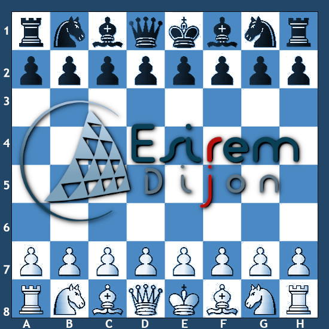

# Python Project 2022 - ESIREM

## Documentation :
[Online documentation](https://doc-jeu-python.vercel.app/)

### Files Plan
[board.py][Board python file]:

This is the class than handle the chessboard, piece deplacement, checkmates etc...

[jeu.py][Game python file]:

This is the main loop which run the game using pygame.

[piece][Pieces python file]:

This is the file contained all the subclasses used to create our pieces objects.

[test_Board.py][The test board.py file]:

This the the file used to run unit test on Board methods.

### Management

Valère and I created a python chess game.

The project had a 3 months deadline so we had to choose wisely how we were going to work.
I think that it is important to specify that we used Trello as our task manager.

The first days were about brainstorming. 
Then the early days development which were crucial because time would become less dispensable from now on.

At the end, we're now able to play basic chess, we could't develop some advanced rules so we lack: pat, en passant, and roque.
I'm down writing this fully filled readme as my last task. 

### Our issues and how we reach them

The first issue we instantly spot was to manage the pulls requests and the commits.
A senior would have to pass aways the commentaries about them but as Juniors they really helped both of us to follow our work wisely without to check every moment if there was an error or not. Github begun now an habit!

#### Special thanks
Valère and I were really grateful for this Python project, knowing it was our first one.

#### Contributors

| Contributors | profile link |
| ------ | ------ |
| Camil BENAMEUR | [Profile](https://github.com/camilbenameur)  |
| Valère DUMONT | [Profile](https://github.com/Valeredeterre)  |

##### Credits

Each piece from our ChessMate Game come from : [test_Board.py][The test board.py file] Valère DUMONT | [Profile](https://github.com/Valeredeterre)
